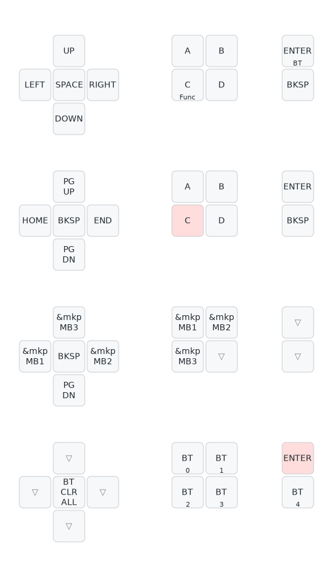

# Futhesia Moduora (MaRiMo) - フセシア・モデュオラ（マリモ）

```
                                                                                         
   `         `  `   `  `  ` ` `  `  ` `   `   `      `   `  `   `           `
           `                    `                `               `   `  `
   `  `           `  `   `         `  ....  `   `   `  `     `      `     `
  `             `      `  ` `  `     dM"YMh.  `          `     `         `  `  `
         `   `      `   ..... `  `  ,M]  .M\       `  `.,  `     `
     `     `      `   ..YYMM=        TMNMMD      `  (MNNMNMR  `    `  `      `
  `   `       ` `   .MNMNMm.   `  `    M#   ` `    .JM#=?TMN..    `    ` ` `
        `  `       .NNMNNMNMMMMMMNa, ` M#  `.&MMMMMMNN[  .NMY'   `            `
   `         `  `  ,MNMMNNMF      .Wh `M#  dB!      MMNMMMMM;        `    `
 `   `              .TMMMB^   `  `  M[ M# .N    `   .!.MM\ !  `  `      `
      `  ` `   `  .         .MMMMMMMN] M# ,MMMMMMMN,         ..     `       ` `
   `        `  .MMWMN.    .MM"      M] M# ,N      ?MN,.   .JM"HN,  `   `
        `      (M, .NMMMMMH=        M] M# ,M        ?HMMMMMNL .MF        `
    `           7MM#=    `    `  `  M].MN.,N   `      `    /WMM"     `    `  `
           ` `                    `.M'dMMb.M,    `      `         `
 `   `  `      `       `  `  `    .M^-FJFW[(N,     `                  `  `   `
           `      ` `    `    ` .dD .# dF.M,.Hm.    `  `  `  `  `   `      `
    `   `    `  `    `      `  .M^ .M!.M@ -N. WN,                       `
  `                     `     .MF .N] .N#  M] ,NM,   `     `  `  `   `       `
      `    `   `  `    `  ` .JMM` -M  JM#  dF  NMMm.   `    `      `     `
   `         ..............dMN#! .MF  dM]  MN  HNMNMN-.............        `
        `   .MNNMNMMMMMNNMNMMt..MMN]  MM  .NNp .MNNMNNMNMMMNNMMNMMNl  `   `   `
            ,NMMNNMNNMWWMNMNNNMMNNM` .M@  dMNMN,.TMNM"T"  T"TNNMNNM]    `
   `  `     ,NNMNNND.(NN,,MNMNNNMM$ `JNN. JMNNMMNMNNM\ .+g, ,MNMNMN]
            ,MNNMNM`dMNNM[(NMMNMNF  JNNMh. TNMNNMNM#  .MNMM   MNMNM]  `      `
    `       ,MNMNMNb,BMMD.MNNMNM@ .MNNMNNNJ.?NMNNMNMM\ .""! ,MNMNNM]    `  `
            ,NMNMNNMMa++MMNMNNNNNMNMNMNMMNNMNMNMNNMNMa-g  +aJMNMNMN]
  `         ,MNNNMNNNNMNNNMNMMNMNMNNM"&..,TMNNMNMNNMNNMNMNMNNNMNMNN]         `
       `    ."HMMHWWWHNMHHHHHMMHMNHD.MNNNMNe7WNMHMMHWHHHHWWWWWWNMWB!   ` `
    `    `     dN    ,MN    ,N@ dN .MNMMMNMN_ M# dM            N#          `  `
           `   `?    ,NN   `,M@ dN` HNNNNNN#  M# dM      `     N#           `
 `    `             ..MM, ` ,N@ dN   ?WMM#"   M@ dM   `    `   N#   ` `  `
             `      JMNMM-  ,M@ dN`        `  M# dM    `       M#
    `      `    `   MNNNN]  ,NF ZMNNNNNNNMNNNNNF ?NMMMMMMMMMMMMNF  `    `  `  `
       `           .MMNNMb             `      `           `           `
  `         `       TMMMM3     `    `      `      `   `        `  `
     `         `             `   `                   `      `           `  `
        `  `                `      `  `  `  `  `   `    `       `    `      `
  `          `    `  `    `    `                `          `  `    `          `                         
                                                                                         
```

A distributed knowledge-type input device discovered in Realm of Split IV.  
分割界・最深層で自己発生した集合知式入力装置群

## Classification | 分類
- **Species**: Synaptica Modularis (集合知式入力装置群)
- **Common Name**: MaRiMo (マリモ)
- **Origin**: Realm of Split IV / Hadop stratum (分割界IV・Hadop層)
- **Distribution**: Collaborative developer habitats; replicates through Nodes and shared configs (共創環境に分布し、Nodeと設定共有で増殖)
- **Nature**: ZMK-based split-grid organism with 3 Node slots; continually reconfigurable (ZMK駆動・3スロット拡張の分割格子型／可変・進化)

## Overview | 概要
MaRiMo is an intellectually and structurally evolving input device that spontaneously emerged from information dust accumulated in the Hadop stratum.
Its appearance carries traits of MeKaBu, and by connecting three external modules (Nodes), it can freely change its form—much like MeKaBu.

マリモはHadop層に堆積する情報塵から自然発生した知的・構造的進化を続ける入力装置である。
その外見はMeKaBuの特徴を有しており、外部モジュール（通称：Node）を3つ接続することで、MeKaBuと同様に自在に形を変える。

## Key Features | 特徴
- **Tri-Node Morphology (三節変形)**: A 3-slot Node architecture that recomposes the device by swapping modules (3スロットのNode構造により、モジュール交換で形状と役割を再構成)
- **ZMK Symbiosis (ZMK共生)**: Firmware-defined behavior that evolves through keymaps, overlays, and snippets (キーマップ／オーバーレイ／スニペットで行動を規定し、更新で進化)
- **Input Constellation (入力星座)**: Nodes can host encoders, joysticks, trackballs, touchpads, and more (エンコーダ／ジョイスティック／トラックボール／タッチパッド等をNodeとして接続)
- **Config Propagation (設定伝播)**: Knowledge spreads through shared configs and collaboration, accelerating iteration (設定共有と共創によって知が伝播し、反復が加速する)

## Natural Habitat | 生態／運用環境
Even in solitary operation it is expected to exhibit high performance, but in collaborative habitats its potential is observed to expand without bound—especially when coexisting with MeKaBu.
単体での生息でも高いパフォーマンスを発揮するポテンシャルが想定されているが、共創型の環境ではその可能性が際限なく拡張されることが観測されている。
特にMeKaBuとの協調により、事象は臨界へ向かうと推測される。

### Current Keymap Configuration | 現在のキーマップ構成


---
*This configuration exists in the liminal space between reality and digital dreams.*  
*この設定は、現実とデジタルの夢の間の境界に存在する。*
